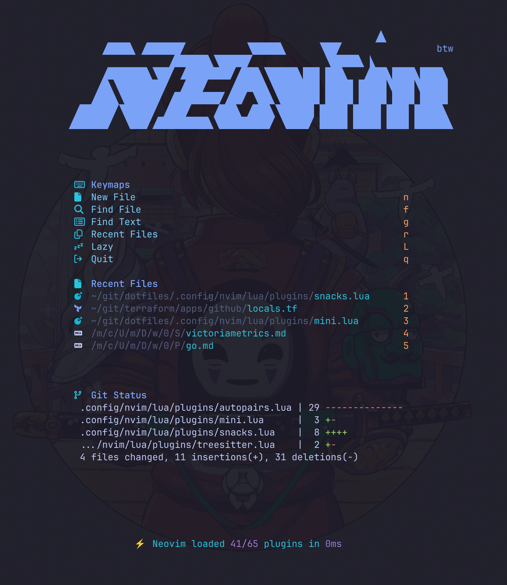

# Dotfiles



Personal development environment configuration for macOS and cross-platform tools.

## Tools & Configurations

### Terminal & Shell
- **zsh** - Shell configuration with aliases, functions, and keymaps
- **starship** - Cross-shell prompt with custom styling
- **atuin** - Shell history sync and search
- **tmux** - Terminal multiplexer with custom keybinds and theme

### Text Editors & IDEs
- **nvim** - Neovim configuration using Lazy.nvim with extensive LSP, DAP, and plugin setup
- **zed** - Modern editor configuration replicating nvim-like experience

### Terminal Emulators
- **ghostty** - GPU-accelerated terminal emulator configuration

### Window Management
- **aerospace** - Tiling window manager for macOS with custom keybinds

### AI Agents (`ai/`)
Layout is `ai/shared/` (vendor-neutral) + one dir per harness. One canonical
source per file; every harness gets a symlink.

| Source | Deployed to | Consumed by |
|---|---|---|
| `ai/shared/AGENTS.md` | `~/.claude/AGENTS.md`, `~/.codex/AGENTS.md`, `~/.pi/agent/AGENTS.md`, `~/.config/opencode/AGENTS.md` | all four (Claude Code via `CLAUDE.md` import) |
| `ai/shared/skills/<name>` | `~/.claude/skills/<name>`, `~/.codex/skills/<name>`, `~/.agents/skills/<name>` (per-skill) | Claude Code, Codex, pi (`~/.agents` is pi's native path) |
| `ai/pi/models.json` | `~/.pi/agent/models.json` | pi — custom model provider endpoints |
| `ai/pi/settings.json` | `~/.pi/agent/settings.json` | pi — theme, TUI, packages, warnings |
| `ai/pi/mcp.json` | `~/.pi/agent/mcp.json` | pi — MCP server endpoints (gateway) |
| `ai/claude/CLAUDE.md` | `~/.claude/CLAUDE.md` | Claude Code only — imports `AGENTS.md`, adds herdr/CC rules |
| `ai/claude/agents/<name>` | `~/.claude/agents/` | Claude Code subagents (`kate`, `mike`, `gomez`, `pandey`, `rachel`) |
| `ai/claude/settings.json` | *(not symlinked — live `~/.claude/settings.json` has diverged; kept as reference)* | Claude Code |
| `ai/claude/*status_line.sh` | referenced by `settings.json` | Claude Code |

**Not yet ported:** subagents for Codex (`~/.codex/agents/` + `multi_agent` feature)
and pi (`pi-subagents` package) — different frontmatter schemas; reuse the persona
bodies from `ai/claude/agents/` when needed. opencode config beyond `AGENTS.md`.
Third-party skills (`herdr`, `humanizer`) stay installer-managed in `~/.agents/skills/`.

### Development Tools
- **opencode** - AI coding assistant configuration with custom modes and agents
- **direnv** - Environment variable management
- **lazygit** - Git TUI configuration
- **bat** - Cat replacement with syntax highlighting and custom themes
- **awscli** - AWS CLI configuration with multiple profiles and endpoints

### Development Environment
- **devbox** - Reproducible development environments with Lua tooling
- **ssh** - SSH client configuration for secure connections

## Key Features

### Neovim Setup
Modern Lua-based configuration using Lazy.nvim with:
- LSP support for multiple languages (Go, TypeScript, Lua, Nix, etc.)
- DAP (Debug Adapter Protocol) integration
- Advanced plugins: Telescope, Treesitter, Copilot, Obsidian integration
- Custom snippets and spell checking

### Tmux Configuration
- Custom theme and status line
- Plugin ecosystem integration
- Session management scripts
- Navigation helpers

### Shell Environment  
- Hostname-based configuration switching
- Custom functions and aliases
- Integrated history search with Atuin
- Starship prompt with git and environment info

### Cross-Platform Support
- macOS-specific tools (Aerospace)
- Linux compatibility for core tools

## Scripts & Utilities
- `tmux-sessionizer.sh` - Quick tmux session creation
- `tmux-sessionkiller.sh` - Session cleanup utility  
- `herdr-sessionizer.sh` - Quick herdr workspace creation
- `herdr-sessionkiller.sh` - Workspace cleanup utility
- `jws-*` scripts - Custom workflow automation
- SSH helpers and navigation tools

## Bootstrap

Everything is wired through a `Taskfile.yml`. Only GNU Stow is a hard
requirement; the Homebrew step is skipped automatically on machines without it.

```sh
task            # list available tasks
task doctor     # report which dependencies are present
task bootstrap  # packages + stow + AI config
```

| Task | What it does |
|---|---|
| `doctor` | Reports which of `stow`, `git`, `nvim`, `brew`, `luacheck` are installed |
| `packages` | `brew bundle --file Brewfile`; prints a note and skips when brew is absent |
| `stow:dry` | Previews the symlinks stow would create in `$HOME` |
| `stow` | Links this repo into `$HOME` |
| `unstow` | Removes those symlinks |
| `ai` | Runs `ai/bootstrap.sh` (`ai/` is excluded from stow, so it links separately) |
| `bootstrap` | `packages` → `stow` → `ai` |
| `check` | Loads the nvim config headless and lints Lua when `luacheck` is present |

Install `go-task` itself first (`brew install go-task`, or see
[taskfile.dev](https://taskfile.dev/installation/) on non-brew machines).

### On machines without Homebrew

`task packages` is a no-op there. The `Brewfile` stays the canonical package
list — install the equivalents with the local package manager, then run:

```sh
task stow
task ai
```

### Manual equivalents

If you would rather not install `go-task`:

```sh
brew bundle --file Brewfile          # macOS only
stow -n -v -d ~/git -t "$HOME" dotfiles   # dry run
stow -v -d ~/git -t "$HOME" dotfiles      # apply
./ai/bootstrap.sh
```

## How the stow layout works

The `.stow-local-ignore` file keeps repo metadata, docs, archives, the
`Taskfile.yml`, and non-home-shaped AI config out of the link set.

After stowing, edit files at their normal runtime paths, e.g. `~/.config/nvim`,
`~/.config/zsh`, or `~/.ssh/config`; changes go through the symlinks back into
this repo.

Zsh uses a stowed `~/.zshenv` to set `ZDOTDIR=$HOME/.config/zsh`, so
`~/.config/zsh/.zshrc` is loaded automatically. The zsh config also adds
`$HOME/scripts` to `PATH`, which points at the stowed `scripts/` directory.
