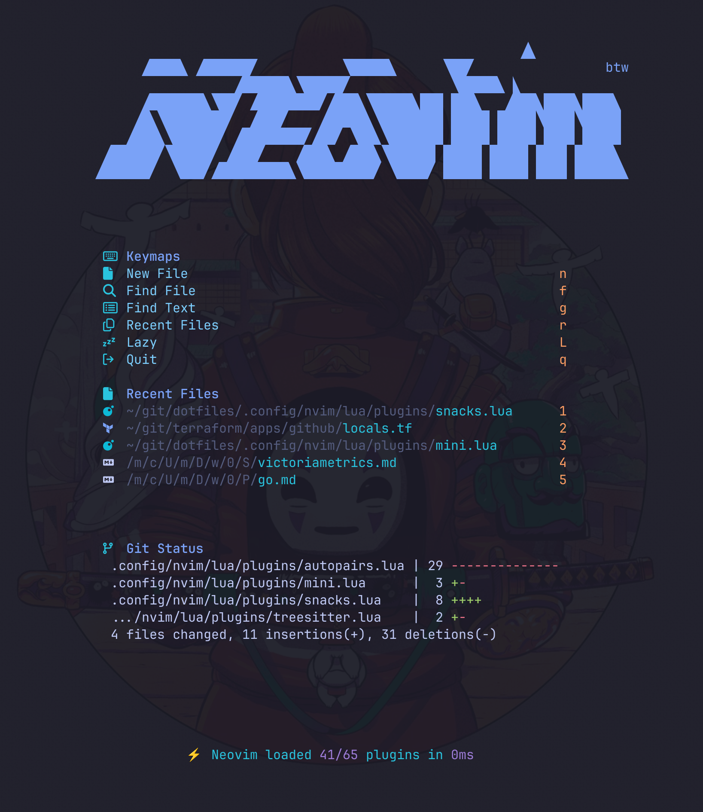

# Dotfiles

Repo consists of configuration for:
- nvim
- tmux
- zsh
- wezterm
- atuin
- bat

# Nvim
The entire setup is now lua and using LazyVim based

# Tmux
Plugins are installed in ~/.tmux/

# Zsh
Calls aliases and sets variables depending on the hostname
